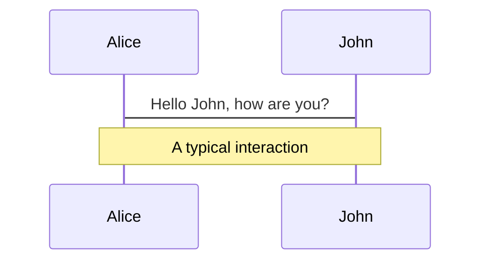
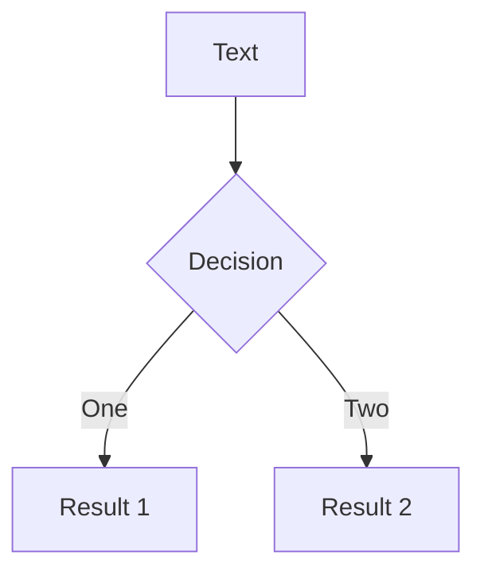
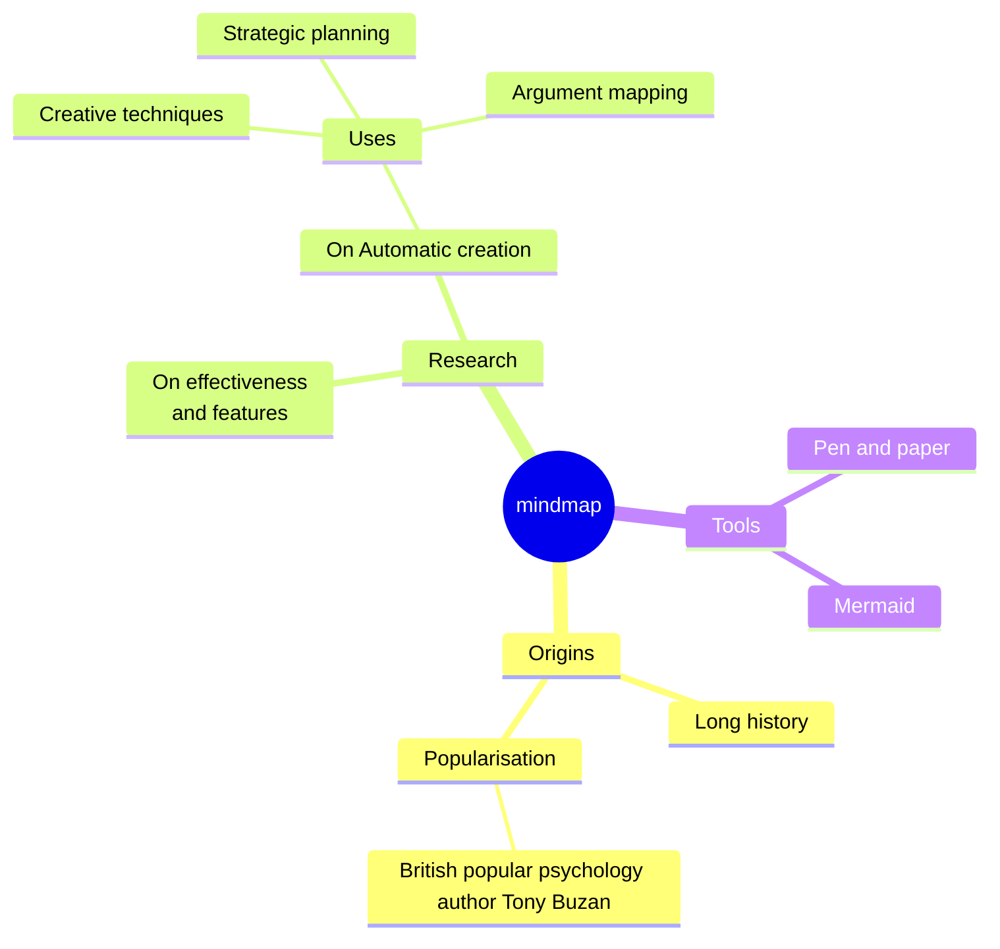
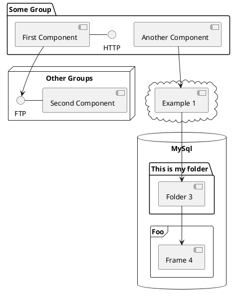

---
# You can also start simply with 'default'
theme: default
# random image from a curated Unsplash collection by Anthony
# like them? see https://unsplash.com/collections/94734566/slidev
background: https://cover.sli.dev
# some information about your slides (markdown enabled)
title: Design System Success
info: |
  ## Design System Success

  learn more at willklein/design
# apply unocss classes to the current slide
class: text-center
# https://sli.dev/features/drawing
drawings:
  persist: false
# slide transition: https://sli.dev/guide/animations.html#slide-transitions
transition: slide-left
# enable MDC Syntax: https://sli.dev/features/mdc
mdc: true
# take snapshot for each slide in the overview
overviewSnapshots: true
---

---
layout: image
image: leaf.webp
---

# Part 1

<div class="abs-br m-6 flex gap-2">
  <button @click="$slidev.nav.openInEditor()" title="Open in Editor" class="text-xl slidev-icon-btn opacity-50 !border-none !hover:text-white">
    <carbon:edit />
  </button>
  <a href="https://github.com/slidevjs/slidev" target="_blank" alt="GitHub" title="Open in GitHub"
    class="text-xl slidev-icon-btn opacity-50 !border-none !hover:text-white">
    <carbon-logo-github />
  </a>
</div>

<!--
Our story begins 6 years and 6 months ago...

I started a new role at my first big tech company in the US, based in the Bay Area but out of an office in Boulder, Colorado.

I joined a diverse and talented team of web and mobile developers, maybe the best team I would ever work on, in fact.

and we were tasked with improving the UX for over 60. million. users.
-->

---
transition: fade-out
---

<!--
This was an enterprise app, where a hundred products were smashed together into a single frankenstein of a user experience.

and back in 2018, "conversational UI" was still trending, so we set out to build a chat assistant that would be a hero to our users.

our mission was to make the most common tasks in our app possible in a few brief messages using our pre-chatgpt AI assistant. our team would deliver a UI component that would exist everywhere, all the time in the app.

floating in the bottom right corner of every web page, and taking one of four navigation icons in our mobile presence.

it would be ubiquitious.
-->
---

<!--
And after two years building and shipping our little chat bubble, we had succeeded in almost every measure.

Over 60M users

an immediate improvement in several key user flows

no major issues in production

and barely any defects at that.

we did it.
-->
---

<!--

But there was a failure on an unnoticeable level

for such a pivotal element of our user experience, we had not relied on another pivotal element of our user experience.

We weren't using our design system.
-->

---
layout: image
image: paper.jpg
transition: fade-in
level: 10
---

<!--
At this point, our design system had lost. It would dream that the designers and developers of this essential user experience would not only be using it, but consulting it daily for guidance. That its components would permeate the designs in Figma, and its tokens and React components would be leveraged throughout the frontend. But not this time.

Let me tell you want happens next.
-->

---
layout: image
image: paper.jpg
transition: fade-in
---

<br>

# What Makes
# a Design System Win

<br>
<br>
<br>
<br>
<br>
<br>
<br>
<br>
<br>
<br>
<br>

# Will Klein

<!--
My name is Will Klein, and

after seeing ours fail, I want to tell you

what makes a design system win

-->

---

<!--

I was the senior UI developer on this project, so why hadn't I used our design system?

I wondered this in the summer of 2020, as I joined the design system demo that was on my calendar, but I had never attended before.

I was friends with the design system team too.

when they open sourced the design system a year earlier, i asked to announce it at a conference i got our company to sponsor.

I recommended two of my friends to the manager, who would later become the most senior contributors on the dev team.

-->

---

<!--
I also wondered about a career shift into developer relations, so I took a chance on proposing a wild idea.

I asked their manager: would they consider hiring me to get developers excited about the design system?

Four months later, I would become the design system developer advocate
-->
---

<!--
All I can remember from my first year

was that I had no idea what I was doing.

At least, it felt that way, but I hoped...

Past Me was was the problem the Present Me needed to solve.

Past me was focused on my team's mission, too busy to check out the design system, which was NOT in the designs, and while we had a few tokens imported in our code base, the library version was years out of date.

We did have several products using our design system, but there were all too many that were apathetic.

They didn't know, they didn't care.

I developed a simple hypothesis:

Developers aren't going to use the design system because it exists.

They are going to use whatever helps them ship their team's product.

-->
---

> Be so good they can't ignore you

<!--
I love this quote from actor Steve Martin.

But what makes a design system "good?"

Our design and our code were both very good. As good as you would hope, and as we would deliver my first major release the following May, I truly believed they were excellent.

Something else needed to change.

-->

---

> Be so *helpful* they can't ignore you

<!--
This wasn't me - our team was already showing up in every UI conversation they could find.

If someone asked about React, web fundamentals, or TypeScript, someone was there to answer questions. It wasn't even about supporting the design system. We had UI experts, and those UI experts were handing out their expertise like free candy.

This wasn't about telling people to use the design system.

It was about being helpful. Being helpful builds trust.

Building trust builds reputation. The marketing word for this is "branding."

And of course, if someone had a design system question, we were on it as fast as someone saw it, and often, two or more developers were in the conversation helping out. Early on, we had lots of questions, and we answered them in our dedicated design system channel in Slack.
-->
---

# The customer is _mostly_ right. About something.

<!--
One thing we believed, was if someone had a problem using our design system, that meant there was something we could improve.

Maybe our docs weren't clear enough. We were missing a code example. Our usage guidance needed improvement. Our component API wasn't flexible enough.

Sometimes it was simply user error, but we always greeted them with:

"i'm sorry, that should work better for you. let's figure this out together"

Before long, our generous sharing of expertise, coupled with an ever-friendly and gentle attitude, meant that our Slack channel started to fill with questions, often not about our design system, but we didn't care. People were asking for help, and we were happy to provide it.

-->
---


<!--
When our fifth major version came out in May of 2021, I would give my first release demo. We had significant changes to our component API.

We bet the house on compound components. We would make our components not rigid and fixed, but flexible and adaptable.

We didn't expect everyone to understand this change though. Our code examples went from a single line to sometimes 30 lines of JSX.

We exposed more inner workings of our components. Taking advantage of this meant a paradigm shift for our developer community.

I also really like teaching,

so we created a trojan horse.
-->

---

> I will teach you something you need to be a better developer

<!--
During our demo, we announced our first workshop: an introduction to compound components.

I didn't say it was about the design system, because at its core, it really wasn't.

Of course we would use our design system components in the example app, and carefully layer many of our new components across our lessons.

The true objective and measure of our workshop's success was if we could level up developers across the company.

We had so many sign ups we offered it twice and reached a staggering percentage of our product teams.

I would give it again the following spring, and less than a year later with three new members of our team, we unveiled a new workshop that taught the fundamentals of responsive design with CSS breakpoints and a few new tricks we had woven into the design system.
-->

---

<!--
Between these workshops, we kept the conversation going regularly in two ways.

Every week, we hosted office hours. At first we tried sign ups, and that worked, as some folks like to schedule face time with us to get support.

Most often though, we were on a walk-in basis. I would post in our Slack channel that office hours had started, and I'd either make a dad joke or suggest we chat about the latest news in frontend. SOmetimes it was just me hosting it, but often, a couple more folks from my team would join, and we'd hang out and ask each other questions.

Then our consumers would join, and it would get so busy that I would create breakout rooms in Zoom to work on everyone's questions in parallel.

After a while, we developed a group of regulars.

folks would join and just hang out. it felt like a club, and one that welcomed anyone and everyone. if they didn't have any questions, I'd just ask them what they were working on and we'd learn more about the problems our product teams were solving, which is great for understanding what problems we needed to solve.
-->

---

<!--
The other way we kept up with everyone was with our release demos.

We started on a monthly schedule with every minor version, but we saw two things happen.

First, we had a few months were we didn't have that much to share, not because we weren't busy, but because much of our work was rolling into the next major version.

Second, as the company grew from around 10,000 employees to around 16,000, we could see meeting fatigue really set in.

So we dialed it back to every six months, to match our major release schedule, and dialed it up to be even more polished and prepared.

(option to introduce slide on predictability - minor and major, and even majors vs odd majors)
-->

---

<!--
I'll never forget my last release demo in May 2023. Along with a design partner in Ireland, Zoe, thank you by the way, we put together a Boy Bands theme.

We had a playlist of pop favorites from the late 90s and early 2000s. We dressed up like we were pop stars, and sprinkled lyrics everywhere in our presentation.

we made it a party, and I think this was an undercount, but I think we had somewhere over 70 folks join in our single biggest Zoom call ever
-->
---

<!--
So...

what did this do for adoption?

well, while I was tracking demo attendance and Slack statistics to track our community, my friend Alan was measuring component usage and library version this month by month.

Not only did we see our adoption grow and accelerate, but Alan led the effort to reach out to product teams directly, to make sure they knew how we could help them ship faster using the design system, and also find out why some were years behind on their library version.
-->
---

<!--
It turns out there was significant lag between when we released a major version, and when teams would update their dependency and take advantage of the latest and greatest.

Early on in my tenure, we had a brainstorm session on what would go into our v5 release in the spring of 2021. I knew how tedious it was to manually edit potentially hundreds of lines of code in a repo, just to update a single dependency. Dependency management was painful, no matter how you went about it.

We were moving to compound components too, and that meant expanding one line of JSX into many more.

So I asked: what if we shipped code mods in v5? We would automate many of our breaking changes.

This would become a staple of every major release. Breaking changes? Yes. Hundreds of lines impacted? Ummm, yeah. You can apply this in minutes? Woah (use the Keanu gif!).

-->
---


<!--
OK, quick timeout, I'm giving a workshop tomorrow on how to write your own code mods. i think it's sold out, but check the website and make sure you are there if there's room!

(repeat the i will teach you line)
-->

---

<!--
We didn't just ship code mods, but rich upgrade guides.

They were called migration guides, but I made a subtle change to call them upgrade guides - hoping that would give the impression it wasn't as dramatic a change.

We clearly spelled out in every guide what components were impacted.

We described how this would affect design and visual presentation.

We described how it would change the implementation in code.

We noted if there was a code mod, which couldn't always be done, but happened for almost everything.

And in our release demos, we wouldn't just showcase our new components, but walk through the impact of every change.

I remember a particular office hours where someone joined to ask about updating their library from 4 versions back. We did a screen share, opened up our update guide, and I went and ran the code mods. We bumped to the next version, and I ran the code mods again. They were so impressed, they asked to end the call, they wanted to try the last two upgrades without me, assisted by the upgrade guide and our code mods.

A half hour later, they told me they were done, and their product was all caught up. We had moved them up four major versions in well under an hour.

-->
---

# Crisis

<!--
Remember our Slack channel?

It tripled in size over 2 and a half years.

We continued to field questions and challenges that were intended for other teams, like when our platform engineering team :cough: at mentioned everyone in the channel about the React 18 upgrade, and how it was happening in a month's time - actually leaving a number of teams scrambling to account for it.

It was the biggest UI channel in our company's Slack, so yeah, if you want to get the word out, @ mention everyone.

By the way, we never @ mentioned anyone. We always made our announcements shiny but concise. We would say "more details are in the thread" with only the most interesting parts mentioned in a brief message.

We considered everyone's time and attention to be precious, so we made sure every communication with our community was well-crafted and thoughtful.

But when this React 18 grenade went off, we jumped on it. We actually saw a consequential impact that we believed could actually hurt our entire company's performance. People were actually quite upset, and I remember joining a call, having invited folks from the platform team, that did not attend, and after 30 minutes they would realize:

it wasn't the design system team that had made the call on executing the React dependency change. We actually supported the new version I think a year in advance, and we continued to be backwards compatible with React 17 for some time after this. But we cared that their concerns were heard, and while we might not have pulled the pin on the grenade, we were there to put it back.

I remember I was really upset the first time this happened in 2022. I dropped everything and scrambled to help address the issue. But... in 2023 a different team from the same group would make the same. exact. mistake.
-->

---

# Trust yields friendship

<!--
Over this time, we established many friends through office hours, demos, and jumping on calls whenever people asked.

Over this time, we would hear from new people, and they would tell us, that our friends had spoken very highly of us. Keep in mind, we were never "mandated" to product teams to use. We had to earn our place in their tech stack. And earn it we did. But what really got us there, couldn't be the effort of a single developer advocate, or even our entire team.

It was our friends that were advocating us, behind their own closed doors, around the world in Canada, the bay area, Ireland, and other offices around Europe.

At times, we saw it in our SLack channel too. We were quick, maybe too quick, to answer questions, but we would see folks around the community show up and help out. Our team could take time off, and questions would get answered, not by us, but by the community itself.
-->
---


<!--
In May of 2023, I gave my last release demo, the boy bands themed celebration of UI components that I'll never forget.

I gave my last workshop, and completed seven other projects in that month to send things off.

If there's anything I hope you'll gather from this talk, I hope you see it's not the design or the code that will make a design system.

Frankly, to deliver accessible and useful components, it takes the best of us to make that happen.

But what will make the difference isn't how good we implement, or even deliver.

I hope we create a developer experience that people can only fall into, like a pit of success, and they can't help but build great things. and of course, a designer experience that does the same

I hope we build communities that are warm, and helpful.

I hope we make friends that we share our time and energy with generously.

I hope we help out even when it's not our fault, because we care about everyone involved.

I hope we have fun, I hope we make it a party.

I believe, that's what make a design system win.

-->
--

<!--
I now work on developer tools full-time at Toolspace, a consultancy I started earlier this year.

fade in email, socials, and thank you

I'm here if you ever want to talk about design systems, it's one of my favorite subjects, along with improving the developer experience.

Thank you.

-->
---

---
<!-- https://sli.dev/guide/animations.html#click-animation -->

<p v-after class="absolute bottom-23 left-45 opacity-30 transform -rotate-10">Here!</p>

---
layout: two-cols
layoutClass: gap-16
---

# Table of contents

You can use the `Toc` component to generate a table of contents for your slides:

```html
<Toc minDepth="1" maxDepth="1"></Toc>
```

The title will be inferred from your slide content, or you can override it with `title` and `level` in your frontmatter.

::right::

<Toc v-click minDepth="1" maxDepth="2"></Toc>

---
layout: image-right
image: https://cover.sli.dev
---

# Code

Use code snippets and get the highlighting directly, and even types hover!

```ts {all|5|7|7-8|10|all} twoslash
// TwoSlash enables TypeScript hover information
// and errors in markdown code blocks
// More at https://shiki.style/packages/twoslash

import { computed, ref } from 'vue'

const count = ref(0)
const doubled = computed(() => count.value * 2)

doubled.value = 2
```

<arrow v-click="[4, 5]" x1="350" y1="310" x2="195" y2="334" color="#953" width="2" arrowSize="1" />

<!-- This allow you to embed external code blocks -->
<<< @/snippets/external.ts#snippet

<!-- Footer -->

[Learn more](https://sli.dev/features/line-highlighting)

<!-- Inline style -->
<style>
.footnotes-sep {
  @apply mt-5 opacity-10;
}
.footnotes {
  @apply text-sm opacity-75;
}
.footnote-backref {
  display: none;
}
</style>

<!--
Notes can also sync with clicks

[click] This will be highlighted after the first click

[click] Highlighted with `count = ref(0)`

[click:3] Last click (skip two clicks)
-->

---
level: 2
---

# Shiki Magic Move

Powered by [shiki-magic-move](https://shiki-magic-move.netlify.app/), Slidev supports animations across multiple code snippets.

Add multiple code blocks and wrap them with <code>````md magic-move</code> (four backticks) to enable the magic move. For example:

````md magic-move {lines: true}
```ts {*|2|*}
// step 1
const author = reactive({
  name: 'John Doe',
  books: [
    'Vue 2 - Advanced Guide',
    'Vue 3 - Basic Guide',
    'Vue 4 - The Mystery'
  ]
})
```

```ts {*|1-2|3-4|3-4,8}
// step 2
export default {
  data() {
    return {
      author: {
        name: 'John Doe',
        books: [
          'Vue 2 - Advanced Guide',
          'Vue 3 - Basic Guide',
          'Vue 4 - The Mystery'
        ]
      }
    }
  }
}
```

```ts
// step 3
export default {
  data: () => ({
    author: {
      name: 'John Doe',
      books: [
        'Vue 2 - Advanced Guide',
        'Vue 3 - Basic Guide',
        'Vue 4 - The Mystery'
      ]
    }
  })
}
```

Non-code blocks are ignored.

```vue
<!-- step 4 -->
<script setup>
const author = {
  name: 'John Doe',
  books: [
    'Vue 2 - Advanced Guide',
    'Vue 3 - Basic Guide',
    'Vue 4 - The Mystery'
  ]
}
</script>
```
````

---

# Components

<div grid="~ cols-2 gap-4">
<div>

You can use Vue components directly inside your slides.

We have provided a few built-in components like `<Tweet/>` and `<Youtube/>` that you can use directly. And adding your custom components is also super easy.

```html
<Counter :count="10" />
```

<!-- ./components/Counter.vue -->
<Counter :count="10" m="t-4" />

Check out [the guides](https://sli.dev/builtin/components.html) for more.

</div>
<div>

```html
<Tweet id="1390115482657726468" />
```

<Tweet id="1390115482657726468" scale="0.65" />

</div>
</div>

<!--
Presenter note with **bold**, *italic*, and ~~striked~~ text.

Also, HTML elements are valid:
<div class="flex w-full">
  <span style="flex-grow: 1;">Left content</span>
  <span>Right content</span>
</div>
-->

---
class: px-20
---

# Themes

Slidev comes with powerful theming support. Themes can provide styles, layouts, components, or even configurations for tools. Switching between themes by just **one edit** in your frontmatter:

<div grid="~ cols-2 gap-2" m="t-2">

```yaml
---
theme: default
---
```

```yaml
---
theme: seriph
---
```


</div>

Read more about [How to use a theme](https://sli.dev/guide/theme-addon#use-theme) and
check out the [Awesome Themes Gallery](https://sli.dev/resources/theme-gallery).

---

# Clicks Animations

You can add `v-click` to elements to add a click animation.

<div v-click>

This shows up when you click the slide:

```html
<div v-click>This shows up when you click the slide.</div>
```

</div>

<br>

<v-click>

The <span v-mark.red="3"><code>v-mark</code> directive</span>
also allows you to add
<span v-mark.circle.orange="4">inline marks</span>
, powered by [Rough Notation](https://roughnotation.com/):

```html
<span v-mark.underline.orange>inline markers</span>
```

</v-click>

<div mt-20 v-click>

[Learn more](https://sli.dev/guide/animations#click-animation)

</div>

---

# Motions

Motion animations are powered by [@vueuse/motion](https://motion.vueuse.org/), triggered by `v-motion` directive.

```html
<div
  v-motion
  :initial="{ x: -80 }"
  :enter="{ x: 0 }"
  :click-3="{ x: 80 }"
  :leave="{ x: 1000 }"
>
  Slidev
</div>
```

<div class="w-60 relative">
  <div class="relative w-40 h-40">
    
    
    
  </div>

  <div
    class="text-5xl absolute top-14 left-40 text-[#2B90B6] -z-1"
    v-motion
    :initial="{ x: -80, opacity: 0}"
    :enter="{ x: 0, opacity: 1, transition: { delay: 2000, duration: 1000 } }">
    Slidev
  </div>
</div>

<!-- vue script setup scripts can be directly used in markdown, and will only affects current page -->
<script setup lang="ts">
const final = {
  x: 0,
  y: 0,
  rotate: 0,
  scale: 1,
  transition: {
    type: 'spring',
    damping: 10,
    stiffness: 20,
    mass: 2
  }
}
</script>

<div
  v-motion
  :initial="{ x:35, y: 30, opacity: 0}"
  :enter="{ y: 0, opacity: 1, transition: { delay: 3500 } }">

[Learn more](https://sli.dev/guide/animations.html#motion)

</div>

---

# LaTeX

LaTeX is supported out-of-box. Powered by [KaTeX](https://katex.org/).

<div h-3 />

Inline $\sqrt{3x-1}+(1+x)^2$

Block
$$ {1|3|all}
\begin{aligned}
\nabla \cdot \vec{E} &= \frac{\rho}{\varepsilon_0} \\
\nabla \cdot \vec{B} &= 0 \\
\nabla \times \vec{E} &= -\frac{\partial\vec{B}}{\partial t} \\
\nabla \times \vec{B} &= \mu_0\vec{J} + \mu_0\varepsilon_0\frac{\partial\vec{E}}{\partial t}
\end{aligned}
$$

[Learn more](https://sli.dev/features/latex)

---

# Diagrams

You can create diagrams / graphs from textual descriptions, directly in your Markdown.

<div class="grid grid-cols-4 gap-5 pt-4 -mb-6">









</div>

Learn more: [Mermaid Diagrams](https://sli.dev/features/mermaid) and [PlantUML Diagrams](https://sli.dev/features/plantuml)

---
foo: bar
dragPos:
  square: 691,32,167,_,-16
---

# Draggable Elements

Double-click on the draggable elements to edit their positions.

<br>

###### Directive Usage

```md

```

<br>

###### Component Usage

```md
<v-drag text-3xl>
  <carbon:arrow-up />
  Use the `v-drag` component to have a draggable container!
</v-drag>
```

<v-drag pos="663,206,261,_,-15">
  <div text-center text-3xl border border-main rounded>
    Double-click me!
  </div>
</v-drag>


###### Draggable Arrow

```md
<v-drag-arrow two-way />
```

<v-drag-arrow pos="67,452,253,46" two-way op70 />

---
src: ./pages/imported-slides.md
hide: false
---

---

# Monaco Editor

Slidev provides built-in Monaco Editor support.

Add `{monaco}` to the code block to turn it into an editor:

```ts {monaco}
import { ref } from 'vue'
import { emptyArray } from './external'

const arr = ref(emptyArray(10))
```

Use `{monaco-run}` to create an editor that can execute the code directly in the slide:

```ts {monaco-run}
import { version } from 'vue'
import { emptyArray, sayHello } from './external'

sayHello()
console.log(`vue ${version}`)
console.log(emptyArray<number>(10).reduce(fib => [...fib, fib.at(-1)! + fib.at(-2)!], [1, 1]))
```

---
layout: center
class: text-center
---

# Learn More

[Documentation](https://sli.dev) · [GitHub](https://github.com/slidevjs/slidev) · [Showcases](https://sli.dev/resources/showcases)

<PoweredBySlidev mt-10 />
